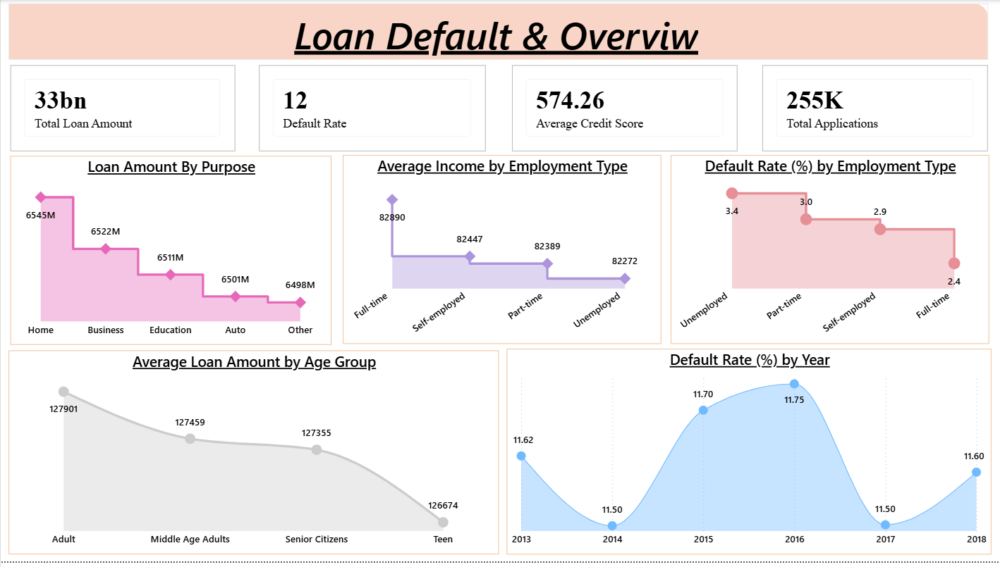
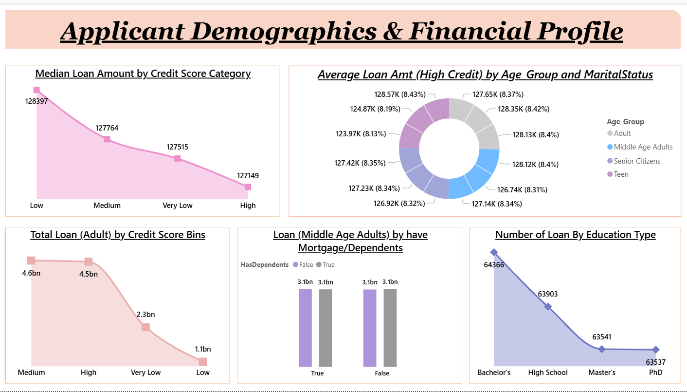
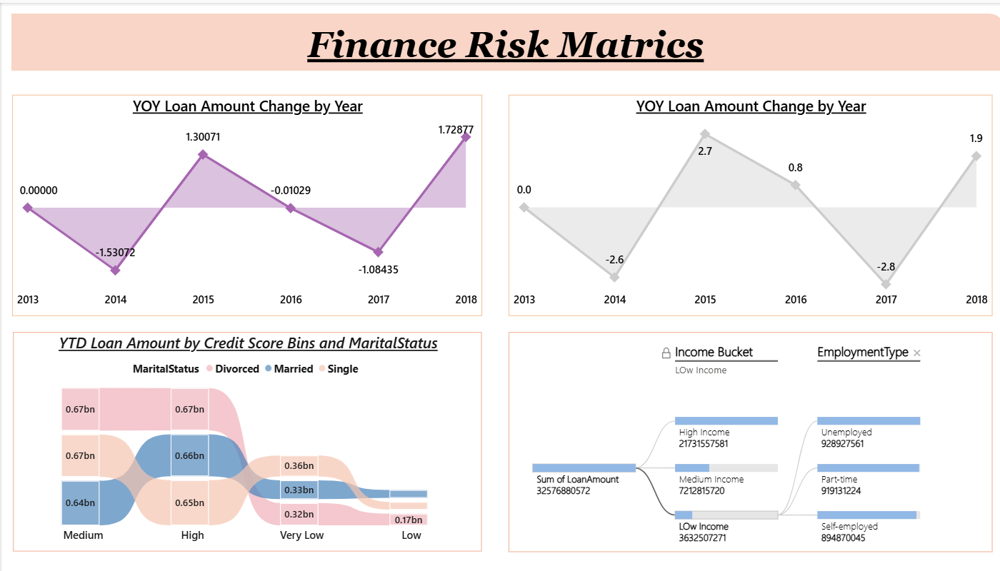

# 🏦 Loan Default Risk Analytics Dashboard


---

## 📌 Project Overview

This project presents an **end-to-end loan risk analytics solution** built entirely in Power BI, analyzing loan default behavior, applicant demographics, credit risk indicators, and financial trends across multiple dimensions.

The project combines:
- 🔄 **Power Query** — Data cleaning, type conversion & transformation
- 📐 **DAX Measures** — Custom calculated columns, KPIs & time intelligence
- 📊 **Power BI** — 3 interactive business intelligence dashboards
- ☁️ **Power BI Service** — Cloud deployment for online access & sharing

> The dataset contains 255K real loan applications. All cleaning and transformation was done inside Power BI before visualization.

---

## 🎯 Project Objectives

This project answers key business questions such as:

- How much total loan amount has been issued?
- What percentage of applicants are defaulting?
- Which employment groups have higher default risk?
- Which age groups receive larger loan values?
- How do credit score categories affect lending patterns?
- How do education and marital status influence loan distribution?
- How has the default rate changed year over year?

---

## 📊 Dashboard Screenshots

### 1. Loan Default & Overview


### 2. Applicant Demographics & Financial Profile


### 3. Finance Risk Metrics


---

## 🛠️ Tools & Technologies

| Tool | Purpose |
|---|---|
| Power BI Desktop | Dashboard development |
| Power Query (M) | Data cleaning & transformation |
| DAX | Calculated measures & columns |
| Power BI Service | Cloud publishing & sharing |
| CSV Dataset | Raw source data |

---

## 📁 Project Structure

```
loan-default-risk-analytics-dashboard/
│
├── dataset/
│   └── Loan_default.csv                  ← Raw source dataset (255K rows)
│
├── dax_measures/
│   └── measures.txt                      ← All DAX measures used
│
├── screenshots/
│   ├── loan_default_overview.png
│   ├── applicant_demographics.png
│   └── finance_risk_metrics.png
│
├── documentation/
│   └── Loan_Project_Documentation.docx   ← Full project documentation
│
├── Loan_Project.pbix                     ← Power BI dashboard file
│
└── README.md
```

---

## 📋 Dataset Description

The dataset contains **255,000 loan applications** with the following columns:

| Column | Description |
|---|---|
| LoanID | Unique identifier per loan application |
| LoanAmount | Total loan value disbursed |
| CreditScore | Applicant credit score (numeric) |
| Default | Boolean — whether the applicant defaulted |
| EmploymentType | Full-time / Part-time / Self-employed / Unemployed |
| MaritalStatus | Married / Single / Divorced |
| Age | Applicant age (used to derive Age Groups) |
| Education | Bachelor's / High School / Master's / PhD |
| Income | Annual income (used to derive Income Bracket) |
| LoanPurpose | Home / Business / Education / Auto / Other |
| HasDependents | Whether applicant has dependents |
| HasMortgage | Whether applicant has an existing mortgage |
| Loan_Date_DD_MM_YYYY | Loan issue date |

---

## 🔄 Data Cleaning Steps (Power Query)

1. Converted `Loan_Date_DD_MM_YYYY` from **text → Date type** for time intelligence
2. Applied `Text.Proper()` to income and categorical columns to fix casing inconsistencies
3. Filtered nulls from `LoanAmount`, `CreditScore`, and `Income` before aggregation
4. Added a `Default Label` column: `"Defaulted"` / `"Performing"` for cleaner visual display

---

## 💡 Key Business Logic

### Income Bracket Classification

```DAX
Income Bracket =
  SWITCH(
    TRUE(),
    'Loan_default'[Income] < 30000,                                        "Low Income",
    'Loan_default'[Income] >= 30000 && 'Loan_default'[Income] < 60000,    "Medium Income",
    'Loan_default'[Income] >= 60000,                                       "High Income"
  )
```

### Credit Score Bins

```DAX
Credit Score Bins =
  IF(Loan_default[CreditScore] <= 400, "Very Low",
    IF('Loan_default'[CreditScore] <= 450, "Low",
      IF('Loan_default'[CreditScore] <= 650, "Medium", "High")))
```

### Age Group Classification

```DAX
Age Groups =
  IF('Loan_default'[Age] <= 19, "Teen",
    IF('Loan_default'[Age] <= 39, "Adults",
      IF('Loan_default'[Age] <= 59, "Middle Age Adults", "Senior Citizens")))
```

---

## 📈 Power BI Dashboards

### Dashboard 1 — Loan Default & Overview
> Executive-level KPI monitoring and loan risk overview

**KPI Cards:** Total Loan Amount · Default Rate · Average Credit Score · Total Applications

**Visuals:**
- Loan Amount by Purpose (Bar Chart)
- Average Income by Employment Type (Bar Chart)
- Default Rate (%) by Employment Type (Bar Chart)
- Average Loan Amount by Age Group (Line Chart)
- Default Rate (%) by Year (Area Chart)

**Key Insights:**
- 🏠 Home loans contribute the highest volume at **6,545M**
- ⚠️ Unemployed applicants show the highest default rate at **3.4%**
- 👨 Adults (20–39) receive the highest average loan at **~127,901**
- 📅 Default rate peaked in **2015–2016 at ~11.75%** and has since declined

---

### Dashboard 2 — Applicant Demographics & Financial Profile
> Applicant segmentation and financial behavior analysis

**Visuals:**
- Median Loan Amount by Credit Score Category (Line Chart)
- Average Loan Amount (High Credit) by Age Group & Marital Status (Donut Chart)
- Total Loan (Adult) by Credit Score Bins (Line Chart)
- Loan (Middle Age Adults) by Mortgage / Dependents (Bar Chart)
- Number of Loans by Education Type (Line Chart)

**Key Insights:**
- 📉 Higher credit score applicants receive slightly lower median loan amounts
- 🎓 Bachelor's degree holders take the highest number of loans (**64,366**)
- 💍 Married applicants in the medium credit bin dominate total loan volume

---

### Dashboard 3 — Finance Risk Metrics
> Advanced financial movement and year-over-year loan trends

**Visuals:**
- YOY Loan Amount Change — Filtered View (Area Chart)
- YOY Loan Amount Change — All Loans Comparison (Area Chart)
- YTD Loan Amount by Credit Score Bins & Marital Status (Sankey Chart)
- Income Bucket vs Employment Type (Decomposition Tree)

**Key Insights:**
- 📈 Loan volume grew by **+1.73%** in 2018 after two years of decline
- 💰 High Income applicants account for the largest share of total loan amount (**21.7bn**)
- 🔗 Medium and High credit score bins dominate YTD loan flow across all marital statuses

---

## 📐 Key DAX Measures

```DAX
-- Base KPIs
Total Loan Amount    = SUM('Loan_default'[LoanAmount])
Total Applications   = COUNTROWS('Loan_default')
Average Credit Score = AVERAGE('Loan_default'[CreditScore])

-- Default Rate (filter-safe)
Default Rate % =
  DIVIDE(
    CALCULATE(COUNTROWS('Loan_default'), 'Loan_default'[Default] = TRUE()),
    COUNTROWS('Loan_default')
  ) * 100

-- Default Rate by Employment Type (context-safe)
Default Rate by Employment Type =
  VAR TotalRecords =
    CALCULATE(COUNTROWS('Loan_default'),
      ALLEXCEPT('Loan_default', 'Loan_default'[EmploymentType]))
  VAR DefaultCases =
    CALCULATE(COUNTROWS(FILTER('Loan_default', 'Loan_default'[Default] = TRUE())),
      ALLEXCEPT('Loan_default', 'Loan_default'[EmploymentType]))
  RETURN DIVIDE(DefaultCases, TotalRecords) * 100

-- YOY Loan Amount Change
YOY Loan Amount Change =
  DIVIDE(
    CALCULATE(SUM('Loan_default'[LoanAmount]),
      'Loan_default'[Year] = YEAR(MAX('Loan_default'[Loan_Date_DD_MM_YYYY]))) -
    CALCULATE(SUM('Loan_default'[LoanAmount]),
      'Loan_default'[Year] = YEAR(MAX('Loan_default'[Loan_Date_DD_MM_YYYY])) - 1),
    CALCULATE(SUM('Loan_default'[LoanAmount]),
      'Loan_default'[Year] = YEAR(MAX('Loan_default'[Loan_Date_DD_MM_YYYY])) - 1),
    0
  ) * 100

-- YTD Loan Amount
YTD Loan Amount =
  CALCULATE(
    SUM('Loan_default'[LoanAmount]),
    DATESYTD('Loan_default'[Loan_Date_DD_MM_YYYY].[Date]),
    ALLEXCEPT('Loan_default', Loan_default[Credit Score Bins], Loan_default[MaritalStatus])
  )
```

---

## 🔍 Key Findings

| # | Finding | Result |
|---|---|---|
| 1 | Total loan amount issued | 33bn |
| 2 | Overall default rate | 12% |
| 3 | Average credit score | 574.26 |
| 4 | Total applications | 255K |
| 5 | Highest default risk group | Unemployed (3.4%) |
| 6 | Lowest default risk group | Full-time employees (2.4%) |
| 7 | Top loan purpose | Home (6,545M) |
| 8 | Peak default year | 2015–2016 (~11.75%) |
| 9 | Highest average income group | Full-time (82,890) |
| 10 | Highest loan volume credit bin | Medium credit score |

---

## ⚙️ How to Use

### Step 1 — Clone the Repository
```bash
git clone https://github.com/abhi14324/loan-default-risk-analytics-dashboard.git
cd loan-default-risk-analytics-dashboard
```

### Step 2 — Open the Dashboard
1. Open `Loan_Project.pbix` in **Power BI Desktop**
2. Click **Home → Refresh** to load the latest CSV data
3. Explore all 3 dashboard pages using the navigation tabs

### Step 3 — Explore the Measures
- Open `dax_measures/measures.txt` to review all custom DAX logic
- All calculated columns are documented with inline comments

---

## ☁️ Power BI Service Deployment

The dashboard has been published to Power BI Service for cloud access.

**View Live Dashboard:** [Click here to open in Power BI Service](https://app.powerbi.com/groups/63261f52-b92b-403b-8f1b-e6e83a0b85c4/reports/7b49efa1-022b-4d6b-a32c-6f09d95a63ba/8a96339dd36393cc42cc?experience=power-bi)

> ⚠️ To generate a safe public link: Power BI Service → File → Embed Report → Publish to web (public) → Copy the iframe/link

Power BI Service enables:
- 🌐 Online dashboard access from any device
- 🔗 Easy report sharing with stakeholders
- 🔄 Scheduled data refresh capability
- 📱 Mobile-friendly dashboard viewing
- 👔 Executive-level presentation ready

---

## 🚀 Future Improvements

- [ ] Add a dedicated **Date table** using `CALENDARAUTO()` for robust time intelligence
- [ ] Add **SQL database integration** instead of CSV import
- [ ] Add **Python-based default prediction** model (logistic regression / decision tree)
- [ ] Add **forecasting visuals** using Power BI's built-in analytics pane
- [ ] Add **borrower segmentation** using clustering on credit score, income & age
- [ ] Add a **drill-through applicant profile page** for individual-level analysis
- [ ] Add **interactive slicers** for Year, Employment Type & Credit Score Bin across all pages
- [ ] Apply a **unified Power BI theme** (JSON) for consistent colors across all pages

---

## 👤 Author

**Abhi**

[](https://linkedin.com/in/abhishek-kumar-a53b46309)
[](https://github.com/abhi14324)
[](mailto:ak38022246637@gmail.com)

---

## 📄 License

This project is open source and available under the [MIT License](LICENSE).

---

> ⭐ If you found this project helpful, please give it a star on GitHub!
